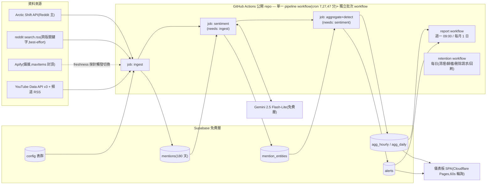

# 即時社群情緒監測系統 — 完整系統設計(Reddit + YouTube)

> **這是本專案的核准設計規格(source of truth)。** 程式碼即依此實作;程式註解多處引用此文件的審查修正。
> 流程:6 路並行研究查證 → 設計初稿 → 3 路對抗性審查(25 條)→ 實作 → 4 路程式碼審查(24 條真 bug 全修)。
> AI agent:先讀 [HANDOFF.md](HANDOFF.md) 了解目前狀態,再用本文件理解「為什麼這樣設計」。

## Context(背景)

操作者(ROG 全球 KOL 與網紅合作經理)需要一套**獨立**系統:近即時監測 Reddit 與 YouTube 上「我方產品」與「競品產品」的市場情緒,支援產品上市與日常 PR 風險監控。單一操作者 + Claude Code 建置維運,全月營運成本 **US$5–20**。

鎖定需求:Reddit 官方 API 不可用(走替代路線)、config 驅動目標(改關鍵字/subreddit/頻道不改程式)、雙層監測(近即時偵測 + 週期彙總)、兩種高風險觸發(情緒驟降、聲量暴衝)、實體平行獨立追蹤(非 SoV,但資料模型預留)、暗色資料密集儀表板、週報+月報。

設計流程:6 路並行研究查證(2026-06-11,含 Reddit 端點實測)→ 初稿 → 3 路對抗性審查(成本數學/失效模式/需求覆蓋,共 25 條發現)→ 本定稿已全數修正。

## 行內假設

- 規模:我方 3–5 實體、競品 4–8 實體;10–15 個 subreddit;15–25 個 YouTube 頻道;月新增 mention 1.5 萬–4 萬則。
- **延遲承諾(誠實值)**:ingest 看到 mention ≈ 20–40 分;**警報觸發** Reddit ≈ 40–120 分、YouTube ≈ 30–80 分(cron 20 分 + 來源索引延遲 + 桶成熟期)。非秒級、非「20 分鐘內必告警」。
- 初始目標清單留白 → generic config schema;repo 內種子資料只放虛構實體,真實 config 由操作者直接入 DB(公開 repo 不洩漏監測對象)。
- 單一使用者;美學沿用操作者既有偏好(暗色 IDE 風,IBM Plex + Ayu 色盤,禁 AI slop)。

---

## 1. 架構總覽



- **近即時路徑**:單一 workflow 內 `ingest → sentiment → aggregate+detect` 以 `needs:` 串接、共用一個 concurrency group(`cancel-in-progress: false`)→ 順序保證 + 防重疊。每 20 分鐘一輪。
- **批次路徑**:每日 retention workflow(30/90/180 天清理、歸檔、YouTube 刪除請求核對、metrics 回刷、failed 重審)+ 週報/月報 workflow。
- **推播擴充點**:`alerts.notified_at` + 未來獨立 notifier job(Slack/Email)。MVP 不做,加裝零遷移。
- **MVP 不用 Supabase Realtime**(審查結論:alert 由 20 分 cron 產生,Realtime 相對 60 秒輪詢只省 60 秒,卻引入 publication/JWT/重訂閱三類最難 debug 的坑)。橫幅走 60 秒輪詢;Realtime 列 v1.x 選配。

## 2. 資料模型(Supabase / Postgres)

### Config 表群

```sql
create table entities (
  id          bigint generated always as identity primary key,
  slug        text unique not null,
  name        text not null,
  side        text not null check (side in ('ours','competitor')),
  active      boolean not null default true,
  thresholds  jsonb not null default '{}',
  created_at  timestamptz not null default now()
);

create table keywords (
  id         bigint generated always as identity primary key,
  entity_id  bigint not null references entities(id),
  keyword    text not null,
  match_type text not null default 'phrase' check (match_type in ('phrase','word','regex')),
  lang       text,
  active     boolean not null default true
  -- 'word'(\b 邊界)僅適用空白分詞語言;含 CJK 的 keyword 一律走子字串匹配(§3)
);

create table sources (
  id         bigint generated always as identity primary key,
  platform   text not null check (platform in ('reddit','youtube')),
  kind       text not null check (kind in ('subreddit','channel','search')),
  source_key text not null,
  config     jsonb not null default '{}',   -- {"cursor":...,"freshness_lag_min":...}
  active     boolean not null default true,
  unique (platform, kind, source_key)
);

create table app_config ( key text primary key, value jsonb not null );
-- 含:警報預設參數、gemini model id 與 RPM/RPD 上限、單日寫入上限、apify maxItems
```

**Config 編輯流程(操作者日常)**:**Supabase Studio Table Editor**(project owner 登入,天然繞過 RLS)。SOP:① `entities` 加實體(slug/side)② `keywords` 加關鍵字綁 entity_id ③ `sources` 加 subreddit/頻道,`active` 開關即生效,下一輪 cron 自動拾取——零程式改動,符合 config-driven 需求。ingest 端對 config 做防禦性驗證:regex 先 `re.compile` 包 try/except,壞 pattern skip + 記入 `pipeline_runs.stats`,單一壞 keyword 不得弄掛整輪。

### 資料表群

```sql
create table mentions (
  id           bigint generated always as identity primary key,
  platform     text not null,
  source_id    bigint references sources(id),
  external_id  text not null,
  kind         text not null check (kind in ('post','comment','video')),
  parent_external_id text,
  url          text,
  author_hash  bytea,                        -- sha256 32B(省空間;不存原帳號)
  title        text,
  body         text,                          -- 受 retention 管制
  lang         text,
  published_at timestamptz not null,
  fetched_at   timestamptz not null default now(),
  metrics      jsonb not null default '{}',
  body_purged_at timestamptz,
  unique (platform, external_id)
);
create index on mentions (published_at);
-- 不建 body GIN 全文索引(免費層空間太貴)

create table mention_entities (
  mention_id  bigint not null references mentions(id) on delete cascade,
  entity_id   bigint not null references entities(id),
  relevant    boolean,                        -- LLM 判不相關 → false,保留列防重分析迴圈
  sentiment   numeric(4,3),
  label       text check (label in ('pos','neu','neg')),
  confidence  numeric(3,2),
  aspects     jsonb,
  model       text,
  analyzed_at timestamptz,
  primary key (mention_id, entity_id)
);
-- 候選對只在 mentions 真 INSERT 時建立(on conflict 判斷 xmax=0);
-- metrics 回刷路徑不得重建候選對 → 杜絕 irrelevant 重分析迴圈

create table agg_hourly (
  entity_id   bigint not null references entities(id),
  platform    text not null,
  source_id   bigint not null default 0,      -- 0 = search 類來源;含 source 維度,儀表板 source 篩選靠它
  bucket      timestamptz not null,
  mention_n   int not null default 0,
  analyzed_n  int not null default 0,         -- 已分析數;偵測器的降級判斷靠它
  pos_n int default 0, neu_n int default 0, neg_n int default 0,
  sent_sum    numeric not null default 0,
  primary key (entity_id, platform, source_id, bucket)
);
create table agg_daily ( like agg_hourly including all );  -- bucket=日,永久保留

create table alerts (
  id bigint generated always as identity primary key,
  entity_id bigint not null references entities(id),
  type text not null check (type in ('sentiment_drop','volume_spike')),
  severity text not null check (severity in ('watch','high')),
  triggered_at timestamptz not null default now(),
  window_start timestamptz not null, window_end timestamptz,
  observed numeric, baseline numeric, zscore numeric,
  evidence jsonb,
  status text not null default 'open' check (status in ('open','ack','resolved')),
  notified_at timestamptz,
  unique (entity_id, type, window_start)      -- 偵測器冪等:同窗重評不重複開單,升級走 upsert
);
-- evidence 在建立當下固化(denormalize):每則 {url, platform, published_at, sentiment,
-- label, aspects, LLM 改寫一行描述(非逐字,符合 YT 政策), reddit 歸檔路徑}
-- → mention 列刪除/原文清空後,alert 仍可自證(PR/法務事後複盤)

create table pipeline_runs (
  id bigint generated always as identity primary key,
  job text not null, started_at timestamptz, finished_at timestamptz,
  status text, stats jsonb   -- {"yt_units":412,"gemini_calls":12,"freshness_lag_min":{"reddit":35},"skipped_bad_keywords":[...]}
);
```

### 聚合策略(冪等重算,非增量)

每輪 aggregate job 對 **trailing 72h(hourly)與 trailing 7d(daily)** 從 `mention_entities`(`relevant=true`)全量重新 upsert(此規模數千列,秒級)。理由:遲到資料有三條路徑(來源索引延遲、Gemini backlog 補分析、metrics 回刷),增量寫入會讓舊桶永遠錯下去;重算窗口讓桶隨資料到齊自動修正。

### Retention(500MB 免費層 + YouTube ToS 雙重約束;審查後修正數字)

| 資料 | 保留 | 依據 |
|---|---|---|
| YouTube `body`(留言原文) | **30 天清空**(`body=null`) | YT 開發者政策 III.E.4.d(Non-Authorized Data ≤30 天;衍生資料不受限) |
| Reddit `body` | 90 天清空,前置歸檔 gzipped JSONL → Supabase Storage(1GB 免費,~6MB/月) | 空間管理 |
| mentions 整列(metadata) | **180 天**刪除(審查修正:365 天會到 400–500MB 直逼 read-only 線) | 空間;趨勢史在 agg_daily 不受影響 |
| mention_entities | 隨 mention cascade | — |
| agg_hourly 90 天 / agg_daily 永久 / alerts 永久(evidence 已固化) | 如左 | 衍生資料 |
| **YouTube 刪除請求核對** | **每日**(併入 retention job;對 30 天內仍存 body 的留言批次驗證存在性,已刪者即清)— 滿足政策 7 日時限 | YT 政策 III.E.4.g |

穩態 DB ≈ **180–220 MB**(40k/月規模重算:mentions 24 萬列含索引 ~105MB + mention_entities ~40MB + Reddit body 窗 ~30MB + agg/系統 ~40MB)。retention job 每週記錄 `pg_database_size`,**>350MB 即告警**(DELETE 不回收空間,等撞線就晚了)。單日寫入上限(預設 5,000 列,`app_config` 可即時調)以「**停止拉取**」實作:fetch loop 達上限即停、**cursor 只推進到已成功寫入的最後一筆**,觸發即告警讓操作者人工決定臨時調高——爆量危機時系統降速而非無聲丟資料。

### RLS 與權限(deny-by-default)

- 全表開 RLS;`anon` 零 policy(全拒)。
- `authenticated`(操作者,email OTP):`select` 全表;alerts 更新走**欄級權限**(RLS 是列級管不到欄):`revoke update on alerts from authenticated; grant update (status) on alerts to authenticated;` + RLS update policy。
- 寫入管線一律 `service_role`(只存 GitHub Secrets);view 一律 `with (security_invoker = true)`。
- Auth 營運細節(審查補):Supabase 內建郵件 ~2 封/時且常進垃圾箱——上線前接自訂 SMTP(Resend/Brevo 免費層);前端 session 持久化 + 輪詢層攔 401 → `refreshSession()` → 重試一次(筆電睡醒 JWT 過期不顯示假性「無警報」)。

## 3. 擷取設計

### 共通機制
- **去重**:`unique(platform, external_id)` + `on conflict do update`(僅 metrics)。
- **游標(重疊窗口,審查修正)**:Arctic Shift 是事後索引,舊 created_utc 的項目可能晚於新項目才進索引——strictly-after 游標會**永久漏資料**。改為:每輪查 `after = cursor − safety_margin`(貼文 margin 3h、留言 90min ≈ 2× 實測最大索引延遲),重複由去重吸收(成本近零);cursor 推進到 `min(max(created_utc seen), now − margin)`。
- **Freshness 探針(審查補,防 Pushshift 式 silent death)**:每輪記錄各 source 回傳的 `max(created_utc)`;全來源 freshness lag > 6h 持續 3 輪 → 視同失敗計入 Apify 切換條件 + healthchecks.io 告警;另設一個高流量對照 subreddit 當 canary。`pipeline_runs.stats` 記 lag,儀表板資料品質區顯示。
- **關鍵字匹配(CJK 修正)**:含 CJK 字元的 keyword **一律純子字串匹配**(Python `\b` 在連續中文間不成立,`r'\b掌機\b'` 會 miss);`word`/`\b` 僅適用空白分詞語言;匹配前做 NFKC 正規化(全形/半形)+ casefold。Phase 2 驗證含中文 keyword 命中率抽查。
- **Backfill**:新來源首拉 7 天(Arctic Shift 按 created_utc 範圍)/15 部(YT playlistItems);偵測只看 `published_at` 在窗內者,不誤觸警報。

### Reddit(官方 API 不可用;實測:`reddit.com/*.json` 對腳本全面 403,**不要碰**;PullPush 已死)

| 路線 | 角色 | 細節 |
|---|---|---|
| **Arctic Shift API**(主) | 指定 subreddit 的 posts + comments | `GET arctic-shift.photon-reddit.com/api/{posts,comments}/search?subreddit=X&after=<cursor−margin>&sort=asc&limit=100`。免費、無金鑰、**雲端 IP 可用**;實測貼文延遲 ~0.8h、留言 20–60min。節流 ≤1 req/s;User-Agent 含聯絡 email(**email 走 GitHub Secret 注入**,不入公開碼)。score/留言數初抓近零、~36h 回填 → 每日 job 回刷 24–48h 前 mention 的 metrics(此路徑不建候選對) |
| **reddit `search.rss`**(輔) | 跨全 Reddit 品牌關鍵字 | 實測可用(100 筆/feed);GHA Azure IP 命中看運氣 → best-effort + soft-skip(403/429 跳過,sort=new 深度 100 自然補)。長期被封 → 改操作者 PC 排程(Task Scheduler,接受睡眠漏跑)POST 到 Supabase,**配獨立 healthchecks.io check** + 儀表板顯示「RSS 最後成功時間」,斷線可見 |
| **Apify `automation-lab/reddit-scraper`**(備援) | freshness 探針或連續失敗觸發 | $1.15/1k posts + $0.575/1k comments。**成本上限按件不按 run(審查修正)**:actor input 設 `maxItems ≤ 500/run`、1 run/日 → 理論上限 ≈$10/月,代價是**降級覆蓋**(優先 posts、每 sub 限量、放棄部分 comments);月花費 >$4 告警 + 人工決策 |

ToS 現實:Reddit UA 禁自動收集、robots.txt 自 2024-06 全禁;2025 年 Reddit 告 Perplexity/Oxylabs/SerpApi——執法對象是商業規模 scraper/proxy 商,小量單人監測的現實風險是封 IP。對策:量最小化、不轉發原文、author 雜湊、操作者知情接受(§10)。

### YouTube(免費配額;2026-06 新制:search.list 獨立桶 100 次/日、主池 10,000 units/日、新增 videos.batchGetStats 獨立桶)

**留言輪詢採 stats-gate 模式(審查修正 blocker:無 gate 的每輪掃描 = 2,160–10,800 units/日,爆紅期會打爆配額)**:

| 步驟 | 方法 | 配額成本/日 |
|---|---|---|
| 頻道新片偵測 | 頻道 RSS(最新 15 部,延遲 ≤1h),每輪 | 0 |
| 新片補抓/backfill | `playlistItems.list`(`UC`→`UU` 零呼叫推導) | ~20 |
| 關鍵字探索 | `search.list` 5 次/日(`publishedAfter+order=date`) | 5/100(獨立桶) |
| **活躍片 stats(= gate)** | 每輪 `videos.list` 50 片/call 撈 statistics | 72 輪 × 1–2 calls ≈ 72–144 |
| 留言 | **僅對 commentCount 有增量的片**呼叫 `commentThreads.list`(100/頁,order=time);分層節奏:發佈 <72h 每輪、3–14 天每小時;14 天移出活躍集 | 穩態 ~100–400 |
| 舊串新回覆(審查補) | 追蹤各 thread `totalReplyCount`,增量時 `comments.list(parentId)` 補抓(吵架串的回覆鏈正是最該監測的) | ~50–100 |
| **合計** | | **穩態 ≈300–800 units/日(3–8%);爆量受 gate 天然封頂** |

護欄:`pipeline_runs.stats.yt_units` 日累計,**>5,000 自動降頻**(活躍片輪詢降為每小時)。API key 限 YouTube Data API v3、放 Secrets;配額重置太平洋午夜。**ToS**:留言原文 ≤30 天(§2)、刪除請求每日核對(§2)、comments disabled 回 403 需吞掉。

## 4. 情緒與富化管線

**選型**(token 估算審查修正:每則輸出 ~50 tokens → 30k 則/月 ≈ 2.4M in / 1.5M out):

| 選項 | 月費 | 角色 |
|---|---|---|
| **Gemini 2.5 Flash-Lite 免費層** | **$0** | **預設**。操作者已實測可行(沿用 `thinkingBudget=0` + maxItems 經驗)。**RPM/RPD 寫進 `app_config`**(免費層數字會變動,保守預設 10–15 RPM;Phase 2 對照 AI Studio 實值校正)。50 calls/日,即使 RPD=1,000 也只用 5%,病毒日 250 calls 仍 25% |
| Gemini 付費 Tier-1 batch | ~$0.5–1.5 | 備援一(**另開 billing GCP project**;billing 一開該 project 免費額度即消失)。輸出欄位縮碼(批內序號、單字母 label)可拉回 <$1 |
| OpenAI gpt-5.4-nano Batch | ~$1–1.5 | 備援二(跨 vendor 風險分散) |
| XLM-R(GHA CPU) | $0 | 僅「LLM 全掛」降級模式:繁中 zero-shot、反諷無感,啟用時報表標資料品質警示 |

模型 id 進 `app_config`(gemini-2.0-flash-lite 已於 2026-06-01 關閉,2.5-lite 同屬汰換週期,後繼 3.1-flash-lite 也有免費層)。

**管線**:
- 每輪撈 `analyzed_at is null` 候選對,**20 則/批**,`responseSchema` 強制 JSON 陣列:`{ref(批內序號), relevant, label, sentiment, confidence, lang, aspects?}`。
- **實體歸因**:關鍵字粗匹配建候選(僅於 mention 真 INSERT 時);LLM 確認情緒,`relevant=false` **保留列**(防重分析迴圈 + 追蹤粗匹配 precision);比較文對 A 正、對 B 負 → 兩列獨立,天然支援平行追蹤與未來 SoV(SoV = 對 `mention_entities` 按 entity 計數,零遷移)。
- **多語**:LLM 自動偵測,EN/zh-TW 全力分析,其他語言照分析但 confidence 折減;`lang` 回填。
- **韌性**:client-side rate limit(讀 app_config)+ 重試 3 次;失敗標 `model='failed'`;**每日 job 對 failed 且 age<7 天者用備援模型重審一次**(否則 YT mention 撐到 30 天 purge 即永久缺席聚合)。
- **ToS**:Gemini 免費層輸入會被 Google 用於改進產品 → 只送公開社群留言,嚴禁混入內部資料(未發佈代號、KOL 合約)。

## 5. 警報邏輯(審查後重訂,修正 partial-bucket 與零值缺列兩個系統性偏差)

預設存 `app_config`,`entities.thresholds` 逐實體覆寫:

```json
{
  "volume":    {"z": 3.0, "high_z": 5.0, "min_count": 10, "high_min_count": 20,
                "baseline_hours": 168, "eval_trailing_buckets": 3},
  "sentiment": {"drop": 0.25, "high_drop": 0.40, "min_mentions": 15,
                "min_analyzed_ratio": 0.8, "baseline_days": 7, "window_hours": 24},
  "cooldown_hours": 12,
  "new_entity_warmup_hours": 72
}
```

**觸發一:聲量暴衝(volume_spike)** — 每輪對每個 active entity(跨平台/來源 roll-up):
1. **評估 trailing 3 個完整小時桶**(非僅最近一桶):來源索引延遲讓桶在收桶後仍持續進貨,重評讓晚到資料補進後 z 重算——漏報變晚報而非永不報。冪等由 `alerts unique(entity_id, type, window_start)` 保證:重評不重複開單,severity 變高走 upsert 升級。
2. baseline = 該桶前 168 小時,**用 `generate_series` 補零後**算 μ、σ(agg_hourly 安靜小時無列,不補零會高估 μ、壓縮 σ,直接廢掉數學)。
3. `z = (count − μ) / max(σ, 1)`。
4. 觸發:`count ≥ 10` 且 `z ≥ 3` → `watch`;**`high` 需同時 `z ≥ 5` 且 `count ≥ 20`**(審查修正:安靜實體 σ floor 下 z 動輒 9+,無絕對量門檻則「watch 不可達、一觸發必 high」)。
5. 新實體 warmup:baseline 覆蓋 <72h 不觸發。日週期誤報(晚高峰)留調參期處理;`thresholds` 預留 same-hour-of-day baseline 選項。

**觸發二:情緒驟降(sentiment_drop)**:
1. `current` = trailing 24h 加權平均(Σsent_sum/Σanalyzed_n,只算 `relevant=true` 已分析);baseline = 之前 7 天(排除當前窗)。
2. **降級防護**:窗內 `analyzed_n/mention_n < 0.8`(Gemini backlog 中)→ 跳過判定並標記降級,避免「未分析=缺漂」造成誤報。
3. 觸發:`drop ≥ 0.25` 且 `analyzed_n ≥ 15` → `watch`;`drop ≥ 0.40` → `high`。

**共通**:12h cooldown(unique 窗去重之外的跨窗抑制);`evidence` 建立當下固化(§2)。
**呈現**:儀表板 60 秒輪詢 open alerts → 頂部橫幅(high=coral、watch=amber)+ entity 卡片旗標。

## 6. 儀表板規格

**技術棧**:Vite vanilla-TS 靜態 SPA → **Cloudflare Pages**(免費、無頻寬上限、無禁商用條款;Vercel Hobby 明文禁商用故排除;GitHub Pages 備援)+ `supabase-js`(anon key + RLS + Auth OTP)+ **ECharts 6** tree-shaken ≈100KB gzip(原生暗色 design-token、`markLine/markArea` 標警報窗、`dataZoom`、LTTB 取樣)。

**美學**:IBM Plex Mono(標題/數字)+ IBM Plex Sans、Ayu 暗盤(bg #0d1017、amber #ffb454、cyan #59c2ff、coral #ff6b6b)、CSS variables、分層氛圍背景、單次 staggered 載入動畫。禁 Inter/Roboto/紫漸層。實作前確認 vibe 一次。

**視圖**:
1. **Overview** — alert 橫幅(open)→ 我方卡列 / 競品卡列(7 日情緒 sparkline、當前情緒色階、24h 聲量 + WoW Δ、風險旗標)。
2. **Entity Detail** — 雙軸主圖(情緒線 + 聲量柱,markArea 標警報窗)、**per-source 切換(subreddit/頻道)**、mention 流(最新/最負面/最高互動,連回原文;已清空者顯示「原文已依政策清除」+ metadata)、Top 負面 aspects。
3. **Alerts** — open/ack/resolved,展開固化 evidence,一鍵 ack/resolve(欄級權限)。
4. **Reports** — 歷期報告列表。
5. **資料品質區塊(審查補)** — 各來源 freshness lag、RSS 最後成功時間、配額/額度用量、降級模式旗標。

**篩選器(全域,補齊 brief 要求的 source 維度)**:entity 多選、side、platform、**source**、時間(24h/7d/30d/90d/custom)。agg 表已含 `source_id` 維度(§2),view 層 roll-up 供 Overview——上線後才補 source 是真 migration,現在做成本近零。
**效能/egress**:一律查預聚合 view;auto-refresh 60s;401 → refresh → 重試。

## 7. 報表規格

**機制**:GHA 排程(週一 09:00 TPE;每月 1 日)→ Python 讀 agg + alerts + 代表 mentions → Gemini 撰敘事 → HTML(同儀表板暗色風)+ MD → Supabase Storage → Reports 頁。

**週報**:① 風險摘要(alerts + 處置)② 逐實體計分卡(情緒/聲量 + WoW Δ、最負面主題)③ 我方 vs 競品分組並排(獨立趨勢,非 SoV)④ Top 5 負面 / Top 3 正面 mentions——**YouTube 來源一律 LLM 改寫(paraphrase)+ 連結,不放逐字原文**(審查修正:報告永久存 Storage,內嵌 YT 原文 = 把 Non-Authorized Data 存超過 30 天,違反政策;Reddit 引文不受此約束)⑤ 資料品質註記(freshness、配額、分析失敗率、降級模式)。
**月報** = 週報結構 + 日粒度月趨勢 + 上月比較 + aspects 演變。

## 8. 成本拆解(審查後統一推導)

| 項目 | 典型月費 | 最壞月費 | 上限機制 |
|---|---|---|---|
| Reddit — Arctic Shift + search.rss | $0 | $0 | 免費;≤1 req/s |
| Reddit — Apify 備援 | $0($5 免費 credit 內) | **~$10**(降級覆蓋) | **maxItems ≤500/run × 1 run/日**(按件封頂,非按 run);>$4/月告警 |
| YouTube Data API | $0 | $0 | stats-gate + 5,000 units 自動降頻;無付費檔位 |
| 情緒 LLM(Gemini 免費層) | $0 | ~$1.5(被迫轉付費 batch) | 50 calls/日;RPM/RPD 進 config |
| Supabase | $0 | $0 | 穩態 180–220MB;>350MB 告警;retention 失守才需 $25 Pro |
| GitHub Actions(公開 repo) | $0 | $0 | 無限分鐘。私有 repo 備案:20 分輪詢 ≈$30/月、小時輪詢 ≈$1–3/月(超出 2,000 免費分鐘少許)、90 分輪詢才完全免費 |
| Cloudflare Pages | $0 | $0 | 無頻寬上限 |
| 自訂網域(選配) | $0(*.pages.dev) | ~$0.9/月 | — |
| **合計** | **≈$0** | **≈$12–13** | **預算 $5–20 內** |

風險槓桿:① Arctic Shift 長期死 → Apify 降級覆蓋 $10/月(若要全覆蓋 ~$45–85/月會爆預算,屆時人工決策);② Gemini 免費層被砍 → <$1.5;③ Supabase 撞線 → 先縮 retention 不升 Pro。

## 9. 建置階段(單人 + Claude Code;審查後重切 Phase 3)

- **Phase 0(半天)**:公開 repo(只放程式碼 + 虛構種子)+ Supabase schema/RLS/欄級 grant + 真實 config 入 DB + GitHub Secrets。驗證:測試列插入,REST 讀取;config SOP 走一遍。
- **Phase 1 — 擷取(2–3 天)**:YouTube(RSS + stats-gate + 留言/回覆)→ Arctic Shift(重疊游標)→ search.rss(soft-skip)→ freshness 探針 + 寫入上限。驗證:連跑兩輪,增量正確無重複;`pipeline_runs` 記 yt_units/freshness。
- **Phase 2 — 情緒管線(1–2 天)**:Gemini 批次 + 冪等聚合(trailing 重算)。驗證:30 則人工對照 ≥80% 一致;**中文 keyword 命中率與繁中樣本單獨抽查**;RPM/RPD 校正。
- **Phase 3a — 警報 + 儀表板(1.5–2 天)**:detector(trailing 3 桶 + 補零 baseline + unique 冪等)+ SPA 三視圖,先用 anon 全讀(RLS 未收緊)開發。驗證:灌負面測試列觸發 watch/high、升級、cooldown;橫幅 60 秒輪詢出現。
- **Phase 3b — 收權(1 天)**:OTP auth(自訂 SMTP)→ RLS 收緊 → 欄級 grant。驗證:incognito anon 全拒;OTP 登入可讀可 ack。(審查理由:RLS 放最後,debug 時資料可見性問題不和功能問題攪在一起。)
- **Phase 4 — 報表 + 維運(1.5–2 天)**:週報/月報、每日 retention(30/90/180 + 歸檔 + **YT 刪除請求核對** + metrics 回刷 + failed 重審)、**Apify 切換邏輯**(審查補:原稿漏排)、keepalive(GHA 60 天 + Supabase 3 天 ping)、healthchecks.io dead-man switch。驗證:產真實週報;手動跑 retention;演練 Arctic Shift 斷線 → Apify 接手(maxItems 生效)→ 恢復補洞。
- **v1.x**:Slack/Email notifier、Supabase Realtime(若想要 <60s)、SoV 視圖、aspects 趨勢、same-hour baseline 調參。

**GHA 工程細節**:近即時三 job 在**單一 workflow** 以 `needs:` 串接,單一 concurrency group(`cancel-in-progress: false`);cron `7,27,47 * * * *`(避整點高峰);全 workflow 加 `workflow_dispatch`;`keepalive-workflow` 防 60 天停用;**日誌紀律含例外路徑**:頂層 exception handler 統一 sanitize(只 log 例外類別 + 計數,絕不印 response body/row data——Supabase 寫入失敗的錯誤會回顯整列,traceback 直出 = 留言原文進世界可讀日誌)。

## 10. 風險與限制

| 風險 | 程度 | 對策 |
|---|---|---|
| **Reddit ToS 灰區**(UA 禁自動收集、robots.txt 全禁;本質是替 ASUS 做商業監測) | 高(合規)/低(實際被告:2025 訴訟對象均為商業 scraper/proxy 商) | 量最小化、不轉發原文、author 雜湊、操作者知情決策 |
| **Arctic Shift 單點故障**(單一維護者、無 SLA、Pushshift 前例;**真實死法是 200 + 索引停擺**) | 高 | freshness 探針(不只看 HTTP 錯誤)+ canary subreddit + Apify 降級接手 + 重疊游標可補洞 |
| **GHA cron 抖動**(5–30 分延遲常態、高峰可整輪漏跑) | 中 | 重疊游標冪等(漏跑=延遲非丟失);dead-man switch 90 分無 ping 告警 |
| **GHA 公開 repo 長駐輪詢的使用政策灰區** | 低–中 | job 短(2–3 分)、repo 是真專案;備案 90 分輪詢回私有免費額度 |
| **YouTube 30 天原文 / 7 日刪除請求** | 確定 | retention 每日 job 雙落實;報表 YT 引文一律改寫;聚合/分數為衍生資料永存 |
| **舊串新回覆盲區** | 中 | totalReplyCount 差量 + comments.list(parentId) 補抓;若簡化省略,須在週報資料品質註記明示 |
| **情緒準確度**(反諷/黑話/混語;繁中免費層品質未系統性驗證) | 中 | 警報靠聚合趨勢稀釋單則誤差;confidence 欄位;Phase 2 繁中抽查;週報品質註記 |
| **誤報**(小樣本、日週期晚高峰) | 中 | min_count + σ floor + high 絕對量門檻 + warmup + cooldown;上線首兩週調參期;same-hour baseline 備選 |
| **免費層政策變動**(Gemini 降額、Supabase、Arctic Shift) | 中 | 每項具名備援 + 切換開關;RPM/RPD/模型 id 全在 config;`pipeline_runs` 用量預警 |
| **Supabase 7 天閒置暫停 / 500MB read-only** | 低 | ingest 即保活 + 3 天 ping 保險;>350MB 告警;寫入上限以停拉實作(cursor 不跳過) |
| **規模天花板**(~10 萬 mention/月、~20 實體) | 設計邊界 | 再上去需常駐 worker,超出單人低營運範疇,明確不設計 |

## 驗證方式(整體)

1. **端到端冒煙**:Phase 1–3 後以真實 config(2 我方 + 2 競品、3 subreddit、5 頻道)連跑 48h:增量正確、無重複、yt_units < 1,000/日、情緒抽查(含繁中)、儀表板數字 = SQL 直查。
2. **警報注入**:SQL 灌負面測試列 → 兩型觸發 → watch→high 升級 → 重評不重複開單(unique 驗證)→ ack → cooldown;測畢清除。
3. **安全**:incognito anon 對所有表 REST 查詢 0 列;OTP 登入可讀、僅能改 alerts.status(試改 evidence 應被拒);service key 不在前端 bundle 與日誌;故意觸發一次寫入錯誤,確認日誌無 row data。
4. **韌性演練**:把 Arctic Shift base URL 改錯 + 模擬 stale(回 200 但舊資料)→ freshness 探針觸發 → Apify 接手且 maxItems 封頂 → 恢復後重疊游標補洞、聚合重算回填、晚到桶重評觸發晚報警報。
